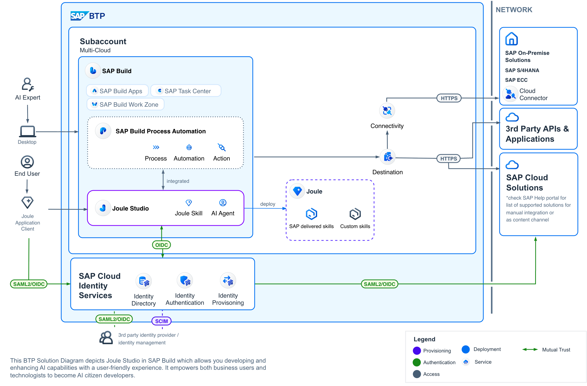
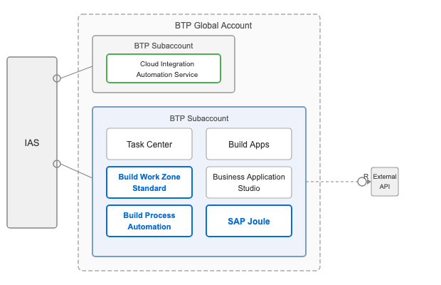

# CLM Day 2026 - Automating SAP Build Setup with Cloud Integration Automation Service and Enabling Custom AI Agent

## Overview

This session introduces participants to the **Cloud Integration Automation Service**, where you will gain hands-on experience implementing automated scenarios on **SAP BTP**. In this hands-on, you will provision SAP Build services and create a custom **Joule agent** that helps maintenance planners validate whether a maintenance order can be fulfilled based on current material stock.

**<ins>Scenario Description</ins>**

Cloud Integration Automation Service simplifies and automates the technical setup of SAP Build — a comprehensive solution for business application development and automation. Rather than configuring each service manually, Cloud Integration Automation Service handles the end-to-end provisioning on SAP BTP, enabling teams to focus on building value instead of managing infrastructure.

As part of this setup, Cloud Integration Automation Service provisions a set of core SAP Build services on SAP BTP. It provisions SAP Build Process Automation and SAP Joule to enable **Joule Studio**, where you can create and deploy custom AI agents. In this hands-on, you will build a custom agent as a practical example of what becomes possible after the automated setup is complete.

**<ins>Configuration of the scenario with Cloud Integration Automation Service</ins>**

In this hands-on session, Cloud Integration Automation Service provisions the following services on SAP Business Technology Platform and sets up integration with SAP Cloud Identity Service. As a final step, you will use **Joule Studio** to build a custom agent and explore one of the outcomes of the automated setup.

## Services Provisioned in SAP BTP

- SAP Build Work Zone, standard edition
- SAP Build Process Automation
- SAP Build Apps
- SAP Task Center
- SAP Business Application Studio
- SAP Joule

## Required Systems & Services

- [x] __Cloud Integration Automation Service__: BTP Service used to set up the technical configuration of the integration scenario involving the below systems.
- [x] __SAP BTP Global Account__
- [x] __Cloud Identity Authentication Service__

## Exercises

- [Exercise 1 - Generate the Workflow](ex1/README.md)
- [Exercise 2 - Monitor and Complete the Setup](ex2/README.md)

Once you complete the above exercises, you will have provisioned and configured services on BTP using Cloud Integration Automation Service and created a custom Joule agent in Joule Studio.

> **About CIAS:** New to Cloud Integration Automation Service? Read [About CIAS and Its Components](info/README_1.md) for an overview of the service, its capabilities, and the key components you will use in this hands-on.

> **Further Reading:** Curious about the data behind the agent? See [About the Sample Maintenance Backend](info/README_2.md) for the data model, entity descriptions, and sample prompts to try.

## Resources
1. [Cloud Integration Automation Service Discovery center](https://discovery-center.cloud.sap/serviceCatalog/cloud-integration-automation?region=all&service_plan=standard&commercialModel=cloud)
2. [SAP Help Portal](https://help.sap.com/docs/cloud-integration-automation/user-guide/overview?locale=en-US)
3. [SAP BTP Global Account](https://emea.cockpit.btp.cloud.sap/cockpit/?idp=clm-day-01.accounts.ondemand.com#/globalaccount/9d88d4f5-c80a-4986-8a56-dbf4b7b5a223) tenant used during the hands-on session.

## Code of Conduct
Please read the [SAP Open Source Code of Conduct](https://github.com/SAP-samples/.github/blob/main/CODE_OF_CONDUCT.md).

## How to obtain support
Support for the content in this repository is available during the actual time of the online session for which this content has been designed. Otherwise, you may request support via the [Issues](../../issues) tab.

## License
Copyright (c) 2023 SAP SE or an SAP affiliate company. All rights reserved. This project is licensed under the Apache Software License, version 2.0 except as noted otherwise in the [LICENSE](LICENSES/Apache-2.0.txt) file.
