# Exercise 1 - Generate the Workflow
In this exercise, you will __generate a workflow__ for the Integration scenario - __Provision SAP Build services and create a custom Joule agent__.

## Access Information

Use the following credentials to log in to SAP BTP.

1. __Username:__ Use the following email ID (`XX will be the user number assigned to you during the hands-on exercise`)

    ```
    userXX@sapclm.org
    ```

2. __Password:__ Use the following password

    ```
    The password will be provided to you during the hands-on session
    ```

> **Note:** When prompted to select an IDP, choose **clm-day-01.accounts.ondemand.com**.

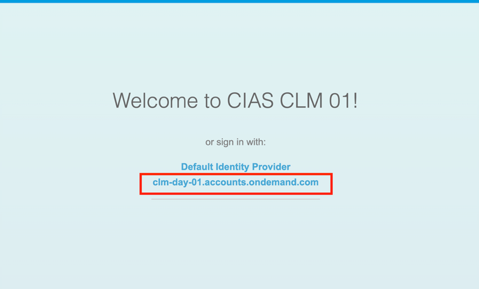

## Access the Cloud Integration Automation Service

* Click on the <a href="https://emea.cockpit.btp.cloud.sap/cockpit/?idp=clm-day-01.accounts.ondemand.com#/globalaccount/9d88d4f5-c80a-4986-8a56-dbf4b7b5a223" target="_blank">BTP Global Account</a>
* Search for your subaccount listed as **CIAS CLM XX**. Click on the subaccount name to open it.
> **Note**: Replace **XX** with your user number.


* Click on **Services > Instances and Subscriptions**
* Click on the icon against Cloud Integration Automation service to launch the application
  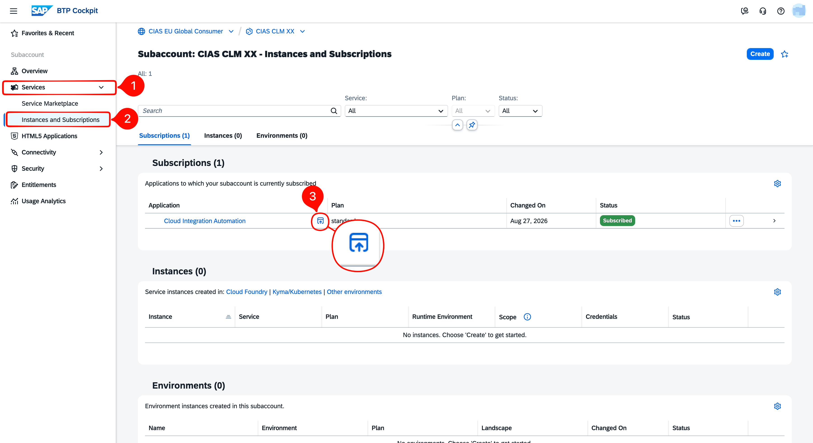

## Plan Integration Scenarios

1. On the Cloud Integration Automation Service Overview screen, select the **Plan Integration Scenarios** tile.

   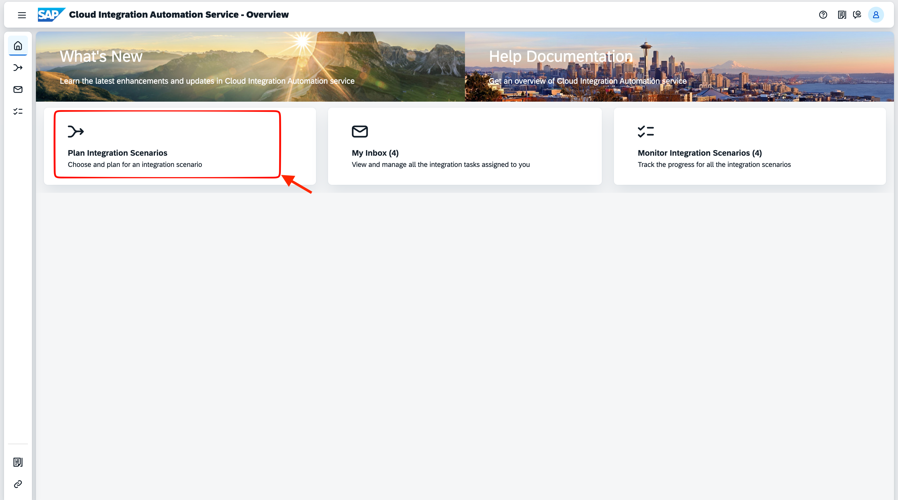

2. On the **Integration Solutions and Scenarios** page, search for **CLM** in the search box. The **CLM Day Event - Hands-On Enablement** solution appears with the 2026 scenario listed.

   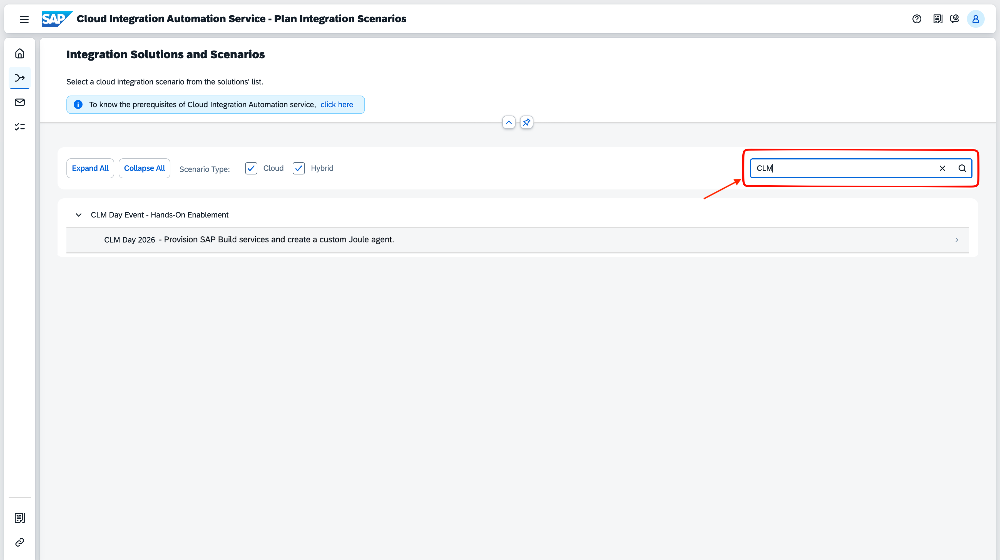

3. Select **CLM Day 2026 - Provision Build services and create a custom Joule agent.** A panel opens on the right showing the scenario description.

   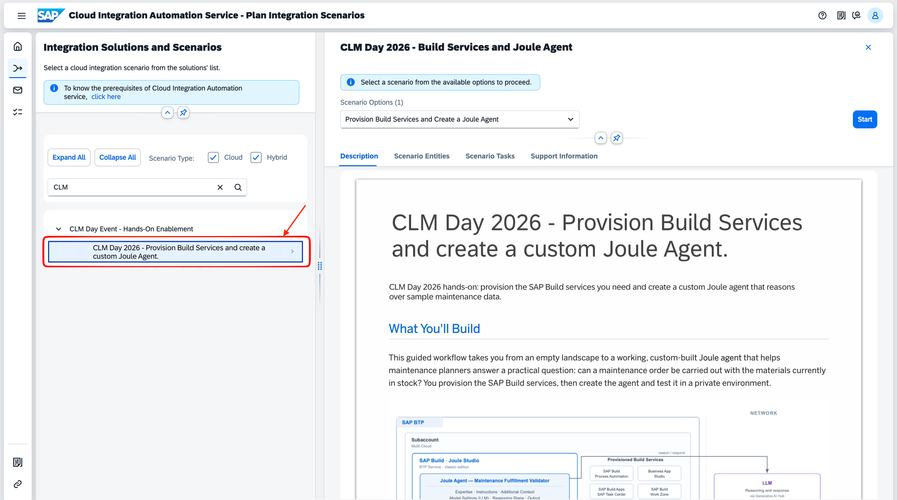

4. Read the scenario description and then click **Start**.

   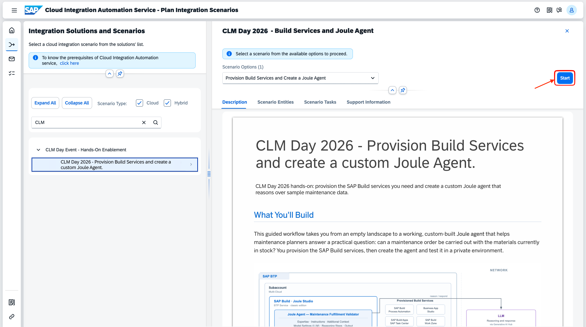

5. In the **Select Scope** step, two services are pre-selected and required to complete this hands-on: **SAP Build Process Automation** and **SAP Joule**. Do not deselect these. The remaining services are optional — you may select additional ones if you would like to explore further. Click **Next Step** to continue.

   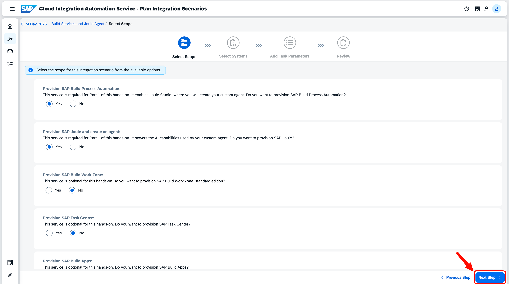

6. In the **Select Systems** step, select the systems to be used for provisioning:
   - Click the value help icon next to the **SAP Business Technology Platform** Tenant field.
     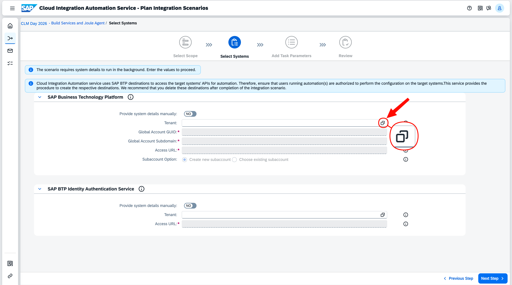
   - A **System Selection** dialog opens. Search for **CIAS EU**, then click on the row — it will be highlighted and shown as **Selected System: CIAS EU Global Consumer** at the bottom. Click **OK**.
     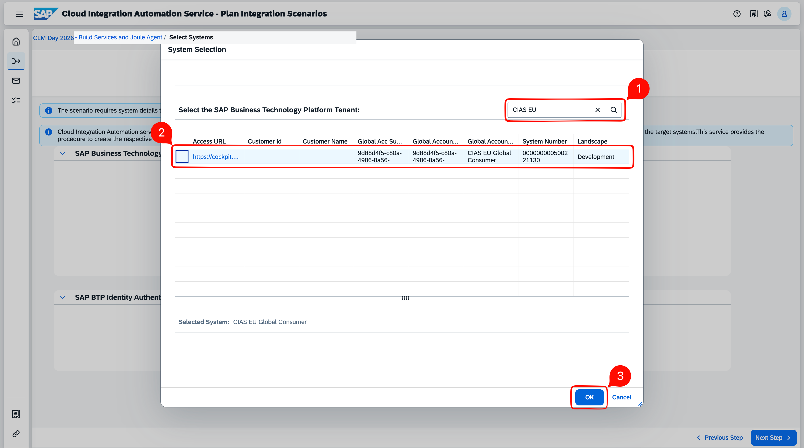
   - Click the value help icon next to the **SAP BTP Identity Authentication Service** Tenant field.
     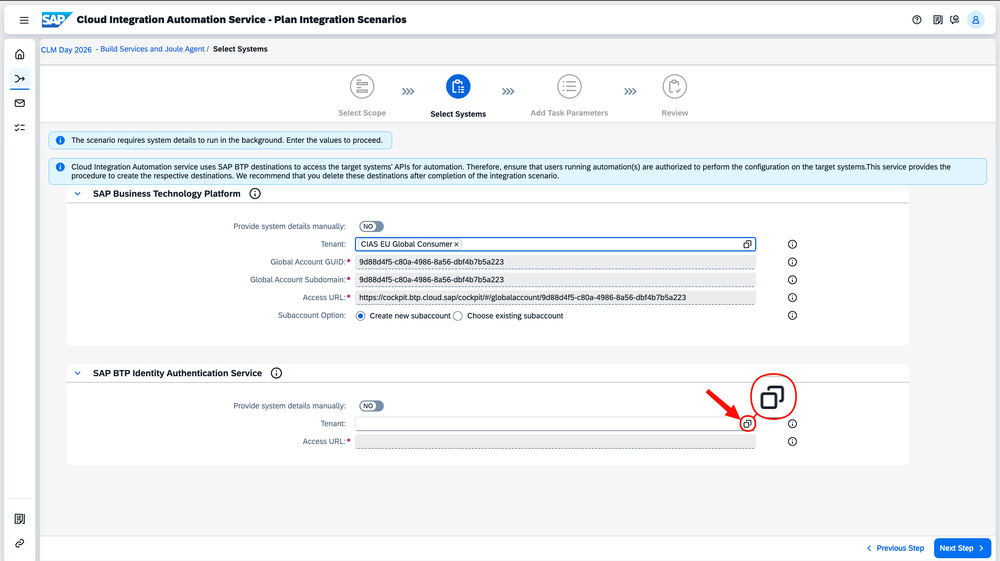
   - A **System Selection** dialog opens. Search for **clm-day-01**, then click on the row — it will be highlighted and shown as **Selected System: https://clm-day-01.accounts.ondemand.com** at the bottom. Click **OK**.
     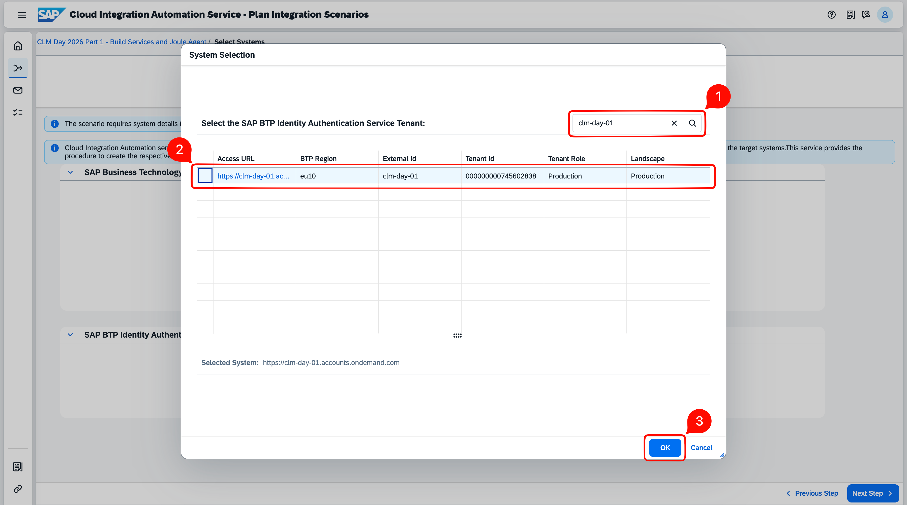
   Once both systems are selected, click **Next Step**.

   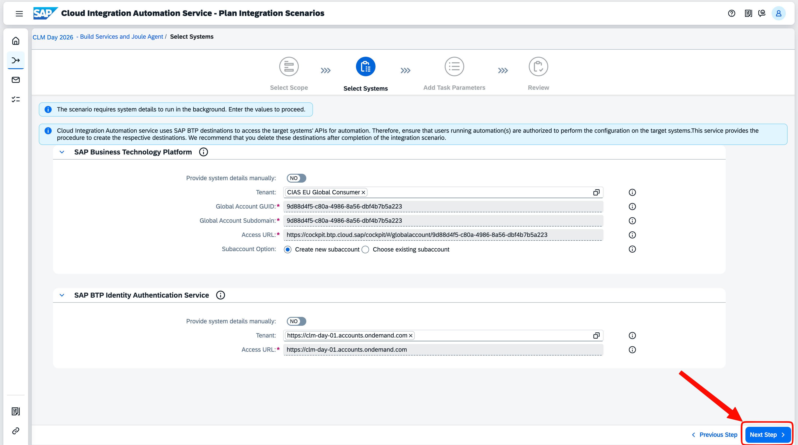

7. A **Systems Details** popup will appear warning about different landscapes, review the details and click **Proceed**.

   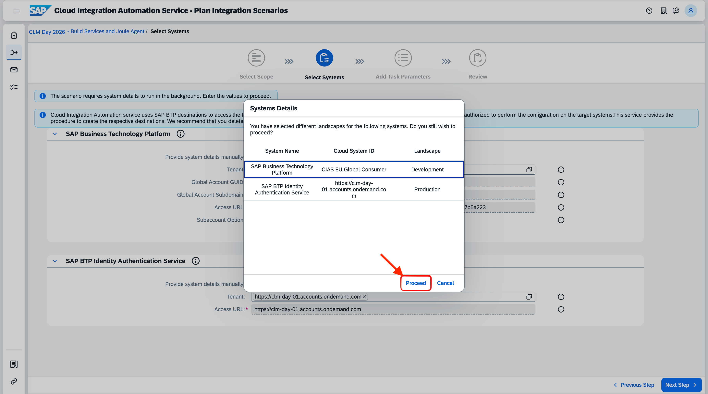

8. In the **Add Task Parameters** step, provide the following values and keep the rest as-is:

   **Subaccount Display Name (1):** JouleAgentXX

   **Subaccount Subdomain (2):** joule-agent-XX

   Click **Next Step**.
> **Note**: Replace **XX** with your user number. Keep the region as **Europe (Frankfurt) - eu10** and leave the Reuse Existing Subaccount GUID parameter blank.

   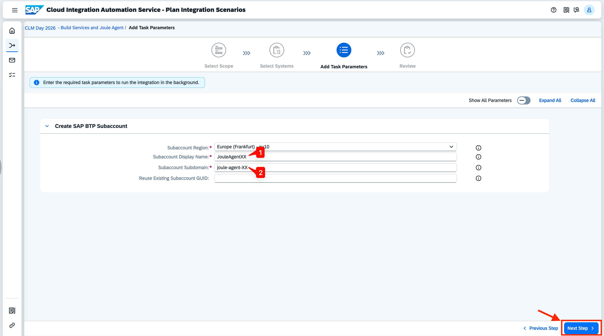

9. In the **Review** step, check the disclaimer checkbox **(1)**, review the summary, and click **Finish**.

   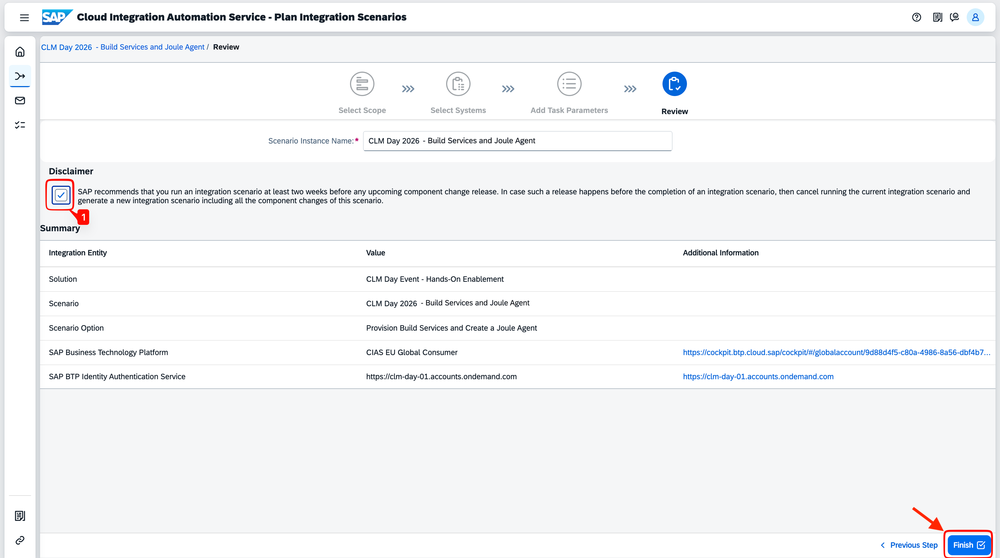

## Result

You've now _successfully_ **generated the workflow**. The success screen shows your **Scenario Instance Name** and an **Integration Overview** summary. Click **Monitor Integration Setup** to navigate to the Monitor Integration Scenarios application and track progress.

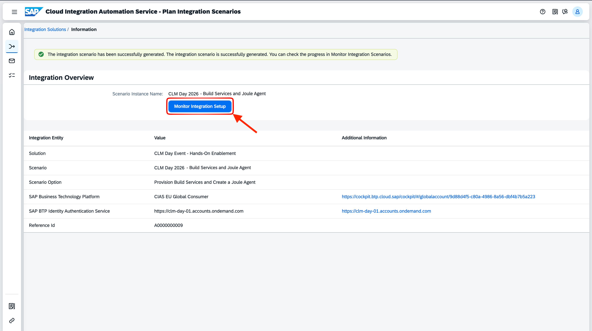

In the next exercise, we will monitor the workflow execution and complete the integration setup.

**Continue to - [Exercise 2 - Monitor and Complete the Setup](../ex2/README.md)**
