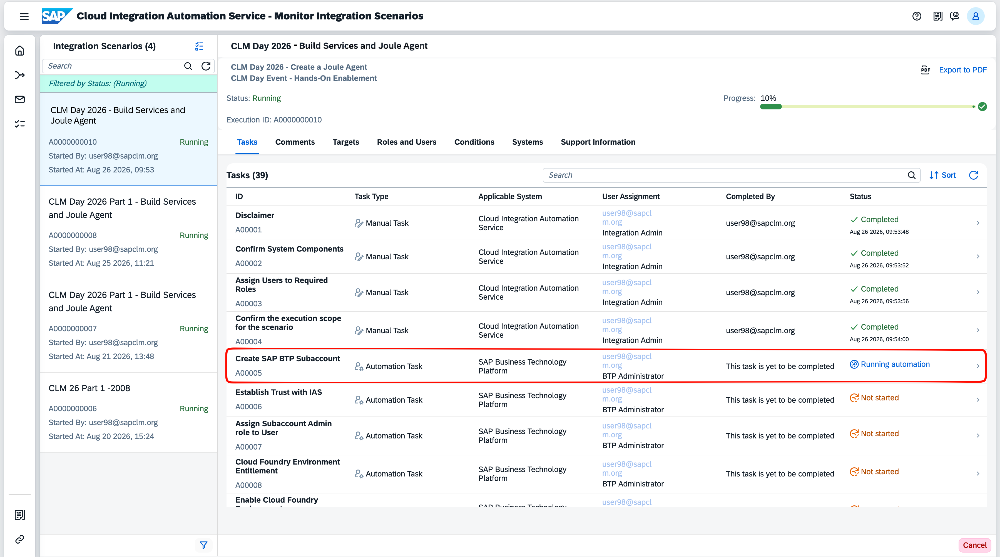
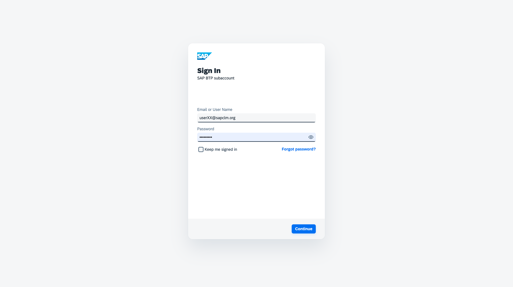
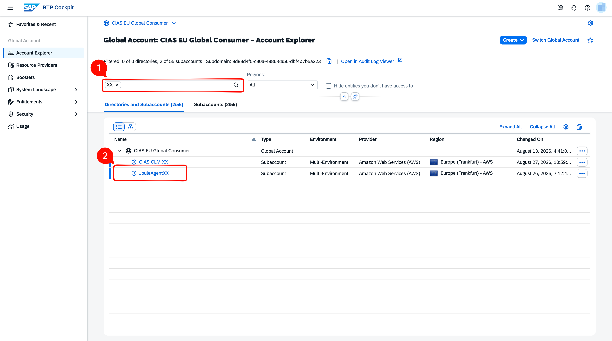
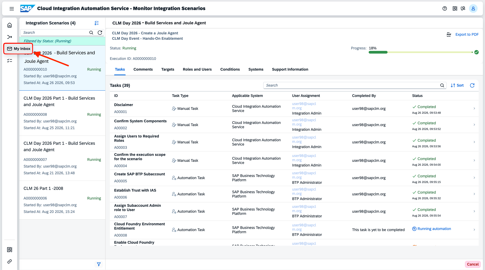

# Exercise 3 - Monitor and Complete the Setup
In this exercise, you will **monitor** the automated provisioning tasks, verify the newly created subaccount, and then complete the manual Joule agent tasks in My Inbox.

## Monitor Integration Scenarios

1. After generating the workflow in Exercise 2, you are taken to the **Monitor Integration Scenarios** application. Select your scenario instance in the left panel to view its task list. The **Tasks** table shows each task with its ID, type, applicable system, and current **Status**.

   Here, you can see the automation task — **Create SAP BTP Subaccount** (A00005) — with status **Running automation**.

   

2. Once **Create SAP BTP Subaccount** reaches **Completed** status, the next task becomes **Ready to be executed** and the automation continues automatically.

   

3. To verify the newly created subaccount, log in to the [SAP BTP Global Account - CIAS EU Global Consumer](https://emea.cockpit.btp.cloud.sap/cockpit/?idp=clm-day-01.accounts.ondemand.com#/globalaccount/9d88d4f5-c80a-4986-8a56-dbf4b7b5a223) using your assigned credentials.

   

4. In the BTP Cockpit, navigate to **Account Explorer**. Search for your user number and you will see the newly created subaccount listed under **Subaccounts**.

   

5. Back in the **Monitor Integration Scenarios** application, the following automation tasks run sequentially.

> **Note:** Tasks marked with *Yes* in the **Optional?** column are rendered based on your scope selection. *Yes* = optional.

| # | Task | Optional? |
|---|------|-----------|
| 1 | Initialise Users | |
| 2 | Create SAP BTP Subaccount | |
| 3 | Establish Trust with IAS | |
| 4 | Assign Subaccount Admin role to User | |
| 5 | Cloud Foundry Environment Entitlement | |
| 6 | Enable Cloud Foundry Environment | |
| 7 | Create Space | |
| 8 | Create Destination and XSUAA services | |
| 9 | Disable Default IDP | |
| 10 | SAP Build Work Zone, standard edition Entitlement | |
| 11 | Activate SAP Build Work Zone, standard edition | |
| 12 | Assign Role Collection for SAP Build Work Zone, standard edition | |
| 13 | SAP Task Center Entitlement | *Yes* |
| 14 | Activate SAP Task Center | *Yes* |
| 15 | Assign Role Collection for SAP Task Center | *Yes* |
| 16 | SAP Build Apps Entitlement | *Yes* |
| 17 | Activate SAP Build Apps | *Yes* |
| 18 | Assign Role Collection for Build Apps | *Yes* |
| 19 | SAP Build Process Automation Entitlement | |
| 20 | Activate SAP Build Process Automation | |
| 21 | Assign Role Collection for SAP Build Process Automation | |
| 22 | Create Destinations for SAP Business Process Automation | |
| 23 | SAP Business Application Studio Entitlements | *Yes* |
| 24 | Activate SAP Business Application Studio | *Yes* |
| 25 | Assign Role Collection for SAP Business Application Studio | *Yes* |
| 26 | SAP Joule Entitlement | |
| 27 | Activate Joule | |
| 28 | Assign Role Collection for Joule Studio | |
| 29 | Create Maintenance Destination | |

Track progress in the **Tasks** table. Once all automated tasks are complete, navigate to **My Inbox** by clicking the inbox icon in the left navigation panel.

## Create the Joule Agent

Once all automated tasks are complete, the following manual tasks will appear in **My Inbox**.

| # | Task | What you do |
|---|------|-------------|
| 1 | Manual Configuration to Activate Joule Studio | Set up the formation to connect SAP Build Process Automation and SAP Joule to enable Joule Studio |
| 2 | Enable AI Agent Builder Activation | Toggle on the AI Agent Builder in the Joule Studio Control Tower |
| 3 | Create a Private Environment | Create a private test environment and bind the maintenance destination to it |
| 4 | Import Project with Skills | Upload the pre-packaged skills project (.mtar file) to the Joule Studio Lobby |
| 5 | Create Maintenance Fulfillment Validator Agent | Build the agent — enter the name, description, expertise, instructions, and add the five maintenance skills |
| 6 | Test in Private Environment | Send a prompt and inspect the Timeline to verify the agent returns a fulfillment answer |

For each task, open it in **My Inbox** and follow the **Task Instructions** tab — it contains all the steps, screenshots, and deep links you need. Choose **Complete Task** when done to move to the next one.

## Result

You have successfully provisioned the selected SAP Build services on SAP BTP and created a custom Joule agent that can validate maintenance order fulfillment.

> Want to know more about the data and the agent queries? See [About the Sample Maintenance Backend](../info/README.md) for the data model and sample prompts.

---

## Feedback

Hope you enjoyed the session! We would love to hear your feedback.

**Continue to - [Home Page](../README.md)**
