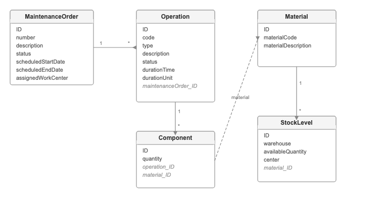

# Further Reading - About the Sample Maintenance Backend

The Joule agent you built connects to a sample CAP-based OData v4 service — `MaintenanceOrderService` — via the `sample-maintenance-service` destination. This page explains the data behind it, introduces the persona who would use it, and gives you some prompts to explore further.

---

## Who Uses This Agent?

**Persona: Maintenance Planner**

A maintenance planner is responsible for scheduling and coordinating maintenance work orders across a plant or facility. Before dispatching a work team, they need to confirm that all required materials and spare parts are available in sufficient quantities. Traditionally, this involves manually cross-referencing the work order, its operations, the required components, and current stock levels across warehouses — a time-consuming process prone to errors.

With the Joule agent, a maintenance planner can simply ask in natural language:

> *"Can Maintenance Order 1 be fulfilled based on current stock?"*

The agent walks the full data chain — order → operations → components → stock levels — and responds with a clear fulfillment assessment and recommendations, saving the planner significant time and reducing the risk of dispatching a team for a job that cannot be completed due to missing parts.

---

## Data Model

The service exposes five related entities:

| Entity | What it represents |
|--------|--------------------|
| **MaintenanceOrder** | A work order to maintain equipment - has a status, scheduled dates, and a work center |
| **Operation** | A step within a maintenance order - describes what work needs to be done and how long it takes |
| **Component** | A material item required to carry out an operation, with a required quantity |
| **Material** | A spare part or consumable — identified by a material code and description |
| **StockLevel** | The available quantity of a material in a specific warehouse and plant center |

**How they connect:** An order contains operations → each operation needs components (materials) → each material has stock levels across warehouses. The agent walks this chain to check if everything needed is available before the order starts.

---

## Sample Dataset

The tables below show the first 10 maintenance orders and all related records connected to them — operations, components, materials, and stock levels.

### MaintenanceOrder

| ID | Order Number | Description | Status | Scheduled Start | Scheduled End | Work Center |
|----|-------------|-------------|--------|----------------|--------------|-------------|
| 1 | 40000001 | SUBST VALV SEG | OPEN | 2025-09-01 | 2025-09-07 | AAAA.AA1 |
| 2 | 40000002 | SUBST PUMP HOSE | OPEN | 2025-09-02 | 2025-09-08 | BBBB.BB2 |
| 3 | 40000003 | REPLC BATTERY UNIT | OPEN | 2025-09-03 | 2025-09-09 | CCCC.CC3 |
| 4 | 40000004 | CHK VALV FUNCTN | OPEN | 2025-09-04 | 2025-09-10 | DDDD.DD4 |
| 5 | 40000005 | UPDT SYS SFTWRE | OPEN | 2025-09-05 | 2025-09-11 | EEEE.EE5 |
| 6 | 40000006 | RPR CNTRL PANEL | OPEN | 2025-09-06 | 2025-09-12 | FFFF.FF6 |
| 7 | 40000007 | INSPECT PIPE LNE | OPEN | 2025-09-07 | 2025-09-13 | AAAA.AA1 |
| 8 | 40000008 | SERV MOTOR UNIT | OPEN | 2025-09-08 | 2025-09-14 | BBBB.BB2 |
| 9 | 40000009 | TEST SAFETY PROG | OPEN | 2025-09-09 | 2025-09-15 | CCCC.CC3 |
| 10 | 40000010 | LUBE MECH BRNGS | OPEN | 2025-09-10 | 2025-09-16 | DDDD.DD4 |

### Operation

| ID | Code | Type | Description | Status | Duration Time | Duration Unit | Maintenance Order ID | Equipment ID |
|----|------|------|-------------|--------|--------------|--------------|---------------------|-------------|
| 1 | 10 | Operation | INSP ELE FUNC VAC SYSTEM | OPEN | 105 | MIN | 1 | 1 |
| 2 | 20 | Operation | RPL BATTERY | OPEN | 120 | MIN | 1 | 1 |
| 3 | 10 | Operation | INSP AIR FLOW | OPEN | 180 | MIN | 2 | 2 |
| 4 | 10 | Operation | CHECK OIL LEVEL | IN PROGRESS | 6 | H | 3 | 3 |
| 5 | 10 | Operation | TEST PRESSURE SENSOR | OPEN | 4 | H | 4 | 4 |
| 6 | 20 | Operation | CALIBRATE TEMP CONTROL | OPEN | 90 | MIN | 4 | 4 |
| 7 | 30 | Operation | INSPECT EXHAUST | OPEN | 210 | MIN | 4 | 4 |
| 8 | 10 | Operation | MODULE INTEGRITY TEST | OPEN | 5 | H | 5 | 5 |
| 9 | 20 | Operation | REPLACE HOSES | OPEN | 200 | MIN | 5 | 5 |
| 10 | 10 | Operation | VALVE CHECK | OPEN | 120 | MIN | 6 | 6 |
| 11 | 20 | Operation | INSPECT HYD LINES | OPEN | 150 | MIN | 6 | 6 |
| 12 | 30 | Operation | CLEAN NOZZLES | OPEN | 4 | H | 6 | 6 |
| 13 | 10 | Operation | CHK SAFETY SWI | OPEN | 5 | H | 7 | 7 |
| 14 | 10 | Operation | VACUUM PRESS TEST | IN PROGRESS | 140 | MIN | 8 | 8 |
| 15 | 20 | Operation | INSPECT MOTOR COIL | OPEN | 3 | H | 8 | 8 |
| 16 | 10 | Operation | INSPECT BEARING WEAR | OPEN | 180 | MIN | 9 | 9 |
| 17 | 20 | Operation | REPLACE MOTOR UNIT | OPEN | 6 | H | 9 | 9 |
| 18 | 30 | Operation | TEST MOTOR FUNC | OPEN | 5 | H | 9 | 9 |
| 19 | 10 | Operation | LUBE VALVE STEMS | OPEN | 3 | H | 10 | 10 |

### Component

| ID | Quantity | Material ID | Operation ID |
|----|----------|-------------|-------------|
| 1 | 1.5 | 1 | 1 |
| 2 | 2.0 | 2 | 1 |
| 3 | 1.2 | 3 | 2 |
| 4 | 0.8 | 4 | 3 |
| 5 | 1.3 | 5 | 3 |
| 6 | 0.7 | 6 | 3 |
| 7 | 2.5 | 7 | 4 |
| 8 | 1.9 | 8 | 4 |
| 9 | 0.6 | 9 | 5 |
| 10 | 2.0 | 10 | 5 |
| 11 | 3.0 | 11 | 5 |
| 12 | 1.8 | 12 | 6 |
| 13 | 1.0 | 13 | 6 |
| 14 | 1.2 | 14 | 6 |
| 15 | 2.3 | 15 | 7 |
| 16 | 0.9 | 16 | 7 |
| 17 | 2.1 | 17 | 7 |
| 18 | 1.5 | 18 | 8 |
| 19 | 1.4 | 19 | 8 |
| 20 | 2.5 | 20 | 8 |
| 21 | 0.7 | 21 | 9 |
| 22 | 3.0 | 22 | 10 |
| 23 | 1.8 | 23 | 10 |
| 24 | 2.0 | 24 | 11 |
| 25 | 1.1 | 25 | 12 |
| 26 | 1.2 | 26 | 12 |
| 27 | 0.9 | 27 | 13 |
| 28 | 1.5 | 28 | 14 |
| 29 | 1.3 | 29 | 14 |
| 30 | 2.0 | 30 | 14 |
| 31 | 2.2 | 31 | 15 |
| 32 | 2.5 | 32 | 15 |
| 33 | 1.7 | 33 | 16 |
| 34 | 1.4 | 34 | 16 |
| 35 | 1.0 | 35 | 16 |
| 36 | 1.9 | 36 | 17 |
| 37 | 1.1 | 37 | 18 |
| 38 | 1.2 | 38 | 18 |
| 39 | 1.0 | 39 | 19 |

### Material

| ID | Material Code | Material Description |
|----|--------------|---------------------|
| 1 | 300000000001 | Vacuum Pump System |
| 2 | 300000000002 | Battery Replacement Kit |
| 3 | 300000000003 | Oil Level Sensor |
| 4 | 300000000004 | Pressure Sensor Module |
| 5 | 300000000005 | Calibration Tool Set |
| 6 | 300000000006 | Exhaust Inspection Mirror |
| 7 | 300000000007 | Motor Coil Set |
| 8 | 300000000008 | Hose Replacement Kit |
| 9 | 300000000009 | Valve Maintenance Kit |
| 10 | 300000000010 | Hydraulic Line Inspector |
| 11 | 300000000011 | Nozzle Cleaning Kit |
| 12 | 300000000012 | Safety Switch Components |
| 13 | 300000000013 | Vacuum Test Adapter |
| 14 | 300000000014 | Motor Bearing Set |
| 15 | 300000000015 | Fluid Circuit Analyzer |
| 16 | 300000000016 | Bolt Fastener Kit |
| 17 | 300000000017 | Belt Wear Gauge |
| 18 | 300000000018 | Plate Resecure Fittings |
| 19 | 300000000019 | Load Bearing Tester |
| 20 | 300000000020 | Battery Carrier Parts |
| 21 | 300000000021 | Gasket Installation Kit |
| 22 | 300000000022 | Control Valve Calibrator |
| 23 | 300000000023 | Cable Connection Kit |
| 24 | 300000000024 | Sensor Output Tester |
| 25 | 300000000025 | Coolant Circuit Replacement |
| 26 | 300000000026 | Air Vent Maintenance Kit |
| 27 | 300000000027 | Dashboard Light Bulbs |
| 28 | 300000000028 | Bike Coupling Set |
| 29 | 300000000029 | Charge System Components |
| 30 | 300000000030 | Vent Unit Replacement Set |
| 31 | 300000000031 | Gain Adjustment Tool |
| 32 | 300000000032 | E-Mag Coil Set |
| 33 | 300000000033 | Shock Absorber Tester |
| 34 | 300000000034 | Air Filter System Parts |
| 35 | 300000000035 | Connector Alignment Kit |
| 36 | 300000000036 | Motor Output Checker |
| 37 | 300000000037 | Alarm Configuration Kit |
| 38 | 300000000038 | Coil Winding Tester |
| 39 | 300000000039 | Lever System Adjuster |

### StockLevel

| ID | Warehouse | Available Quantity | Material ID |
|----|-----------|--------------------|------------|
| 1 | M001 | 0.0 | 1 |
| 2 | M002 | 800.5 | 1 |
| 3 | M001 | 550.3 | 2 |
| 4 | M002 | 120.0 | 2 |
| 5 | M001 | 1350.7 | 3 |
| 6 | M002 | 0.0 | 3 |
| 7 | M001 | 450.0 | 4 |
| 8 | M002 | 0.0 | 4 |
| 9 | M001 | 950.6 | 5 |
| 10 | M002 | 500.3 | 5 |
| 11 | M001 | 0.0 | 6 |
| 12 | M002 | 0.0 | 6 |
| 13 | M001 | 0.0 | 7 |
| 14 | M002 | 670.5 | 7 |
| 15 | M001 | 330.8 | 8 |
| 16 | M002 | 1450.0 | 8 |
| 17 | M001 | 896.7 | 9 |
| 18 | M002 | 0.0 | 9 |
| 19 | M001 | 1200.4 | 10 |
| 20 | M002 | 650.2 | 10 |
| 21 | M001 | 0.0 | 11 |
| 22 | M002 | 920.0 | 11 |
| 23 | M001 | 559.3 | 12 |
| 24 | M002 | 1490.9 | 12 |
| 25 | M001 | 520.0 | 13 |
| 26 | M002 | 300.4 | 13 |
| 27 | M001 | 0.0 | 14 |
| 28 | M002 | 0.0 | 14 |
| 29 | M001 | 212.7 | 15 |
| 30 | M002 | 100.0 | 15 |
| 31 | M001 | 0.0 | 16 |
| 32 | M002 | 1234.4 | 16 |
| 33 | M001 | 678.3 | 17 |
| 34 | M002 | 500.4 | 17 |
| 35 | M001 | 1550.6 | 18 |
| 36 | M002 | 0.0 | 18 |
| 37 | M001 | 0.0 | 19 |
| 38 | M002 | 800.0 | 19 |
| 39 | M001 | 900.1 | 20 |
| 40 | M002 | 450.2 | 20 |
| 41 | M001 | 780.5 | 21 |
| 42 | M002 | 960.8 | 21 |
| 43 | M001 | 1344.8 | 22 |
| 44 | M002 | 0.0 | 22 |
| 45 | M001 | 0.0 | 23 |
| 46 | M002 | 700.2 | 23 |
| 47 | M001 | 987.5 | 24 |
| 48 | M002 | 600.2 | 24 |
| 49 | M001 | 287.5 | 25 |
| 50 | M002 | 1000.0 | 25 |
| 51 | M001 | 900.7 | 26 |
| 52 | M002 | 0.0 | 26 |
| 53 | M001 | 778.4 | 27 |
| 54 | M002 | 450.0 | 27 |
| 55 | M001 | 1256.9 | 28 |
| 56 | M002 | 375.5 | 28 |
| 57 | M001 | 0.0 | 29 |
| 58 | M002 | 650.0 | 29 |
| 59 | M001 | 1050.9 | 30 |
| 60 | M002 | 450.1 | 30 |
| 61 | M001 | 0.0 | 31 |
| 62 | M002 | 0.0 | 31 |
| 63 | M001 | 839.0 | 32 |
| 64 | M002 | 123.0 | 32 |
| 65 | M001 | 900.5 | 33 |
| 66 | M002 | 320.5 | 33 |
| 67 | M001 | 1590.6 | 34 |
| 68 | M002 | 600.0 | 34 |
| 69 | M001 | 750.0 | 35 |
| 70 | M002 | 0.0 | 35 |
| 71 | M001 | 545.3 | 36 |
| 72 | M002 | 123.2 | 36 |
| 73 | M001 | 901.2 | 37 |
| 74 | M002 | 567.0 | 37 |
| 75 | M001 | 670.0 | 38 |
| 76 | M002 | 1234.6 | 38 |
| 77 | M001 | 0.0 | 39 |
| 78 | M002 | 0.0 | 39 |

---

## Sample Prompts

Once your agent is set up, try these in the test chat to explore the data:

**Basic fulfillment check:**
> Can Maintenance Order 1 be fulfilled based on current stock?

**Order details with operations:**
> What operations are planned for order 1, and do we have all the required materials in stock?

**Stock shortage focus:**
> Which materials for order 1 are below the required quantity? What should we do about it?

**Multi-order comparison:**
> Compare orders 1 and 2 — which one is more likely to proceed without delays?

**What-if scenario:**
> If warehouse WH-01 is unavailable, can order 1 still be fulfilled from other locations?

**Proactive planning:**
> List all components for order 1 and their current stock levels across all warehouses.

---

**Back to - [Home Page](../README.md)**
