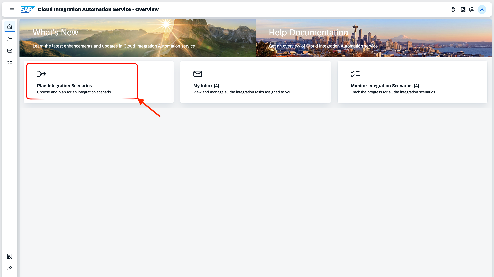
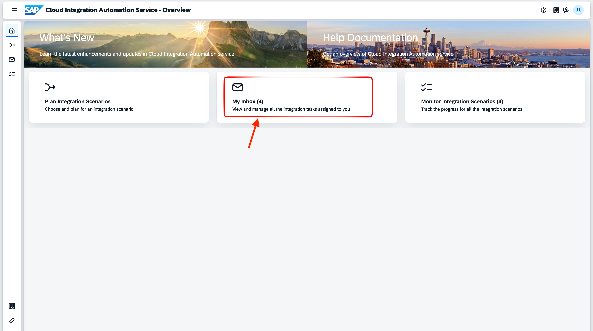
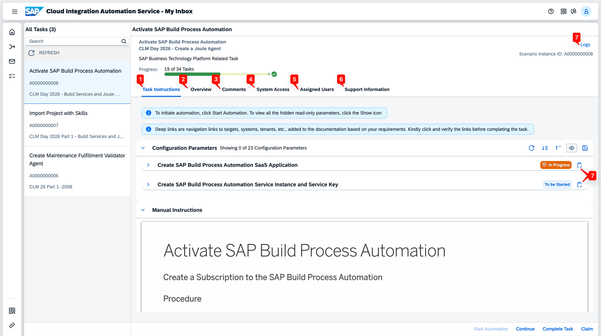
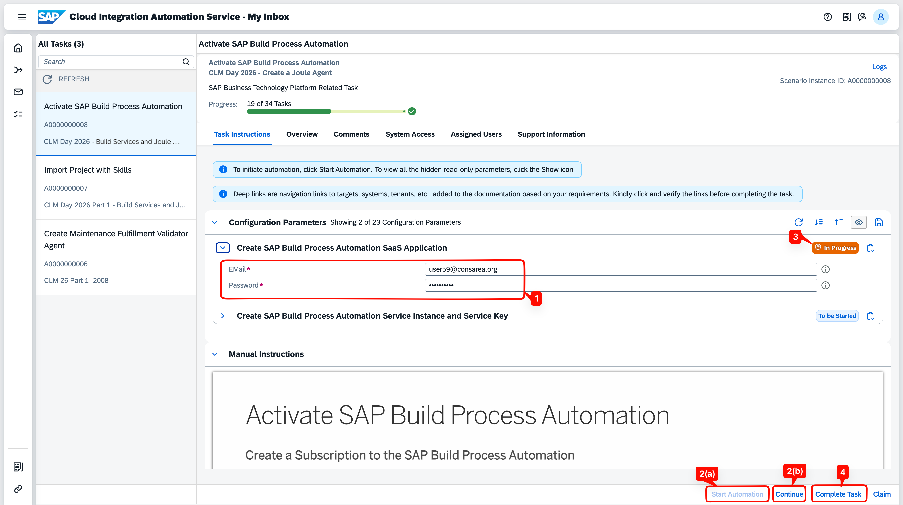
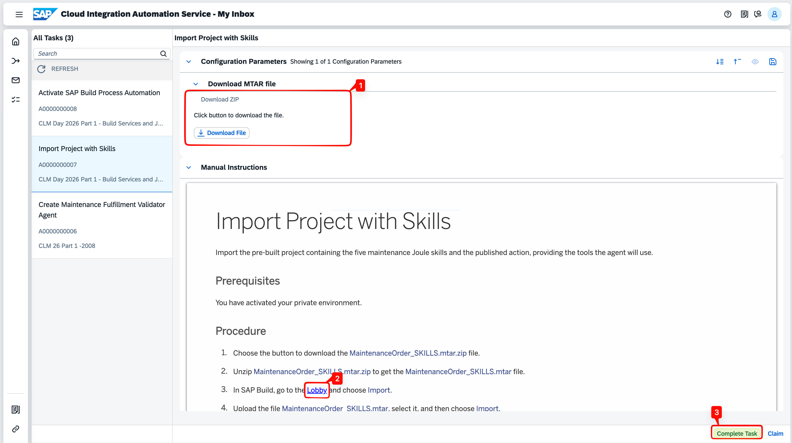
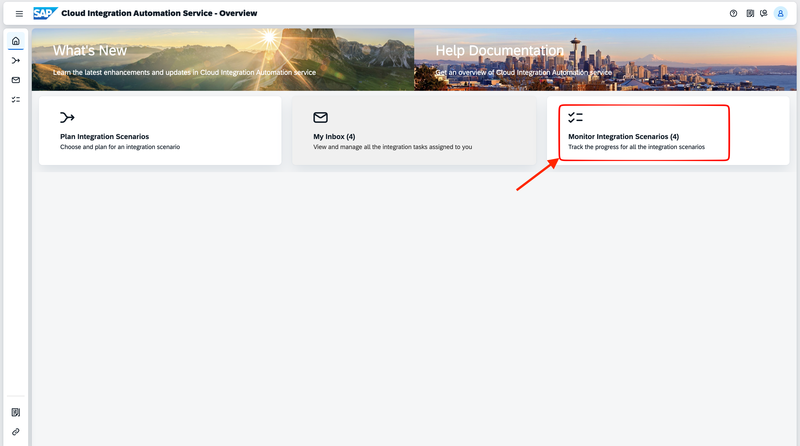

# About Cloud Integration Automation Service

Cloud Integration Automation Service simplifies and automates the technical setup of integration scenarios on SAP BTP. Rather than manually configuring each service, Cloud Integration Automation Service handles end-to-end provisioning — allowing teams to focus on building value instead of managing infrastructure.

---

## The Overview Page

When you open Cloud Integration Automation Service, you are presented with three tiles, each representing a core capability of the service.

---

### 1. Plan Integration Scenarios

**Choose and plan an integration scenario**

This section lists all integration scenarios available in Cloud Integration Automation Service. You can filter by Cloud or Hybrid setup and generate a workflow for the scenario you need. Cloud Integration Automation Service includes integrated landscape discovery, which guides you through selecting the systems in your landscape. For fully automated scenarios, the entire setup runs in the background with no manual intervention required.

---

### 2. My Inbox

**View and manage all integration tasks assigned to you**

My Inbox is where workflow execution happens. Cloud Integration Automation Service automatically delegates tasks to the right users based on their authorizations. An integrated parameter management system pre-populates task parameters from preceding tasks, reducing errors and ensuring consistent configuration across the workflow.

Each task in the Inbox contains the following tabs:

| Tab | Purpose |
|-----|---------|
| **Task Instructions** | Step-by-step instructions for the current task, including configuration parameters and automation controls |
| **Overview** | A read-only hierarchical view of all tasks in the workflow — for reference only; always use Task Instructions to act |
| **Comments** | Add comments to communicate with other users on the same workflow |
| **System Access** | Information about the system associated with the current task |
| **Assigned Users** | Workflow user information for the current task |
| **Support Information** | Metadata about the workflow instance |
| **Logs** | Execution logs after triggering an automation; aggregate logs are available via the **Logs** button in the top right |

#### Types of Tasks

There are two kinds of tasks you will encounter in a Cloud Integration Automation Service workflow:

**Automation Task**

Automation tasks execute configuration steps automatically based on the parameters you provide. You can run them in two ways:

- **Start Automation** — triggers the automation interactively. A status badge next to each parameter section updates in real time. Once the automation completes successfully, click **Complete Task** to advance to the next task.
- **Continue** — runs the automation in the background and completes the task automatically when finished. No further action is needed.

The **Manual Instructions** section below the parameters describes the steps the automation performs, in case you need to execute them manually.

**Manual Task**

Manual tasks require you to perform configuration steps yourself. They may include a parameters section — for example, a file to download — but there is no Start Automation button. Deep links in the **Manual Instructions** section open the relevant system or page directly. Follow all described steps, then click **Complete Task** to proceed.

---

### 3. Monitor Integration Scenarios

**Track progress across all integration scenarios**

The Monitor tile provides a comprehensive view of all workflow instances running in your tenant. It shows each integration scenario, the tasks within it, and their current status and progress. Use this tile to track execution and confirm that automated tasks have completed successfully before proceeding.

---

You can proceed to the first exercise.

**Continue to - [Exercise 1 - Generate the Workflow](../ex1/README.md)**

**Back to - [Home Page](../README.md)**